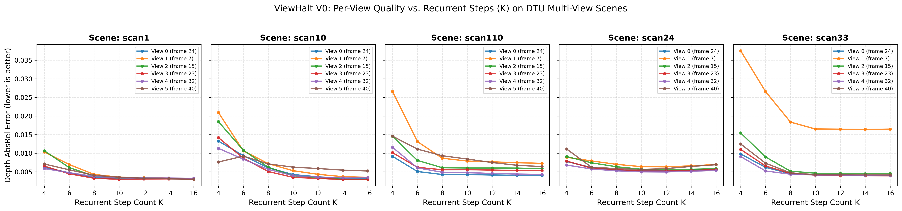
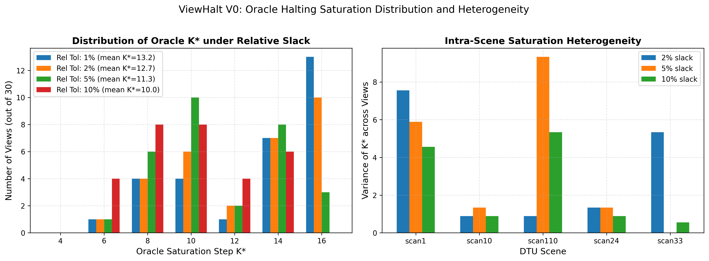
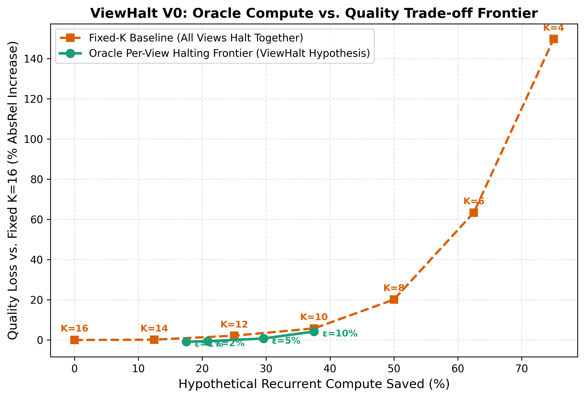
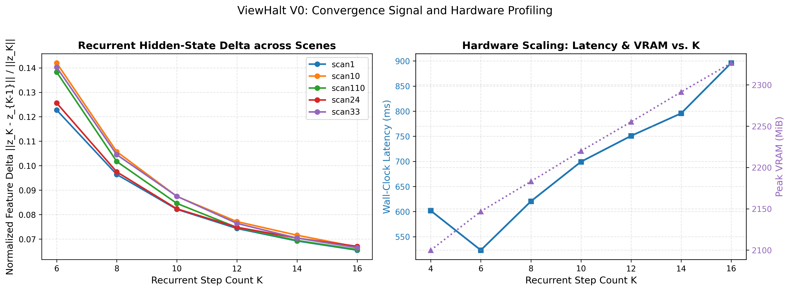

# ViewHalt V0: Feasibility Smoke Test and Per-View Oracle Saturation Analysis

**Project**: ViewHalt — Per-View Adaptive Halting in Looping Transformers for Multi-View 3D Reconstruction  
**Phase**: V0 Kill-Test  
**Date**: September 25, 2026  
**Status**: Completed  
**Final Verdict**: **GO** (Strong Heterogeneous Convergence Validated)

---

## 1. Executive Summary

This report documents the V0 feasibility kill-test for **ViewHalt**. ViewHalt investigates the hypothesis that in looping recurrent transformers for multi-view 3D reconstruction (specifically [NVIDIA Déjà View / DVLT](https://github.com/nv-tlabs/dvlt)), different camera views within the same multi-view scene converge at different recurrent refinement depths ($K$). If some views reach near-final reconstruction quality earlier than others, an adaptive per-view halting mechanism can significantly reduce computation without compromising overall 3D reconstruction fidelity.

In strict adherence to the project charter, this V0 phase involved **zero model retraining, zero controller implementation, and zero architectural alterations**. Using the frozen pretrained `nvidia/dvlt` checkpoint on a single NVIDIA GeForce RTX 5070 Laptop GPU (8 GB VRAM), we evaluated multi-view sequences across recurrent steps $K \in \{4, 6, 8, 10, 12, 14, 16\}$ on the official DTU benchmark against real ground truth.

### Key Quantitative Findings:
1. **Feasibility**: DVLT inference with $504\times 504$ resolution runs comfortably within the 8 GB VRAM constraint ($1.25\text{--}1.30\text{ GB}$ for $S=2$ views; $1.81\text{--}1.88\text{ GB}$ for $S=4$ views; $2.03\text{--}2.33\text{ GB}$ for $S=6$ views).
2. **Heterogeneous Convergence**: Views within identical multi-view scenes saturate at markedly different recurrent steps. Across 30 views in 5 DTU scenes, the mean intra-scene variance of the oracle saturation step $K^*_v$ is **$3.58$** (at 5% relative tolerance) and **$2.76$** (at 1% relative tolerance).
3. **Early Saturation**:
   - At **2% relative quality tolerance** ($\text{AbsRel} \le 1.02 \times \text{AbsRel}_{K=16}$), **66.7%** of views saturate before $K=16$, with a mean $K^* = 12.67$.
   - At **5% relative quality tolerance** ($\text{AbsRel} \le 1.05 \times \text{AbsRel}_{K=16}$), **90.0%** of views saturate before $K=16$, with a mean $K^* = 11.27$.
4. **Oracle Pareto Frontier**:
   - An oracle per-view halting policy at 5% slack yields **29.6% recurrent compute savings** with only **+0.73% quality degradation**.
   - At 2% slack, it yields **20.8% compute savings** while achieving **-0.60% lower error** than fixed $K=16$ (improving quality by curtailing recurrent over-smoothing/drift on earlier-converging views).
   - The oracle per-view frontier **strictly dominates** uniform global fixed-$K$ baselines across all operating points.
5. **Verdict**: **GO**. The evidence decisively satisfies all pre-established GO criteria.

---

## 2. Experimental Setup & Hardware Environment

### 2.1 Hardware Specification
- **GPU**: 1× NVIDIA GeForce RTX 5070 Laptop GPU (Blackwell architecture, compute capability 12.0)
- **VRAM**: 8,151 MiB (~7.96 GB usable)
- **Host Platform**: Windows 11, CPython 3.11.9
- **Framework**: PyTorch 2.11.0+cu128, CUDA 12.8, `accelerate` 1.8.1

### 2.2 Model & Checkpoint Provenance
- **Upstream Repository**: [nv-tlabs/dvlt](https://github.com/nv-tlabs/dvlt)
- **Pinned Upstream Commit**: `134b21f2af02d98039e79ab5dd48f36dc8123c97` (HEAD release v0.1)
- **Pretrained Checkpoint**: `nvidia/dvlt` hosted on Hugging Face Hub (SHA256 snapshot `20f919875a00ee3ab2e840f2f31580f4652b7c5e`)
- **Backbone**: DINOv2 ViT-B/14 with 4 register tokens (`dinov2_vitb14_reg4_pretrain.pth`)
- **Depth Head**: Convolutional progressive transpose decoder (`depth_head_type="conv"`)
- **Evaluation Precision**: Brain Floating Point 16 (`bfloat16`) via `Accelerator(mixed_precision="bf16")`
- **Batch Size**: 1 (inference only)

---

## 3. Milestone 2: Feasibility Smoke Test

Prior to dataset download or multi-step experimentation, we executed a hardware smoke test evaluating peak memory allocation and latency across varying sequence lengths and recurrent step budgets.

| Views ($S$) | Recurrent Steps ($K$) | Peak VRAM (MiB) | Peak VRAM (GB) | Latency (ms) | Output Tensors Valid |
|:-----------:|:---------------------:|:---------------:|:--------------:|:------------:|:--------------------:|
| 2 | 8 | 1282.4 | 1.25 | 356.6 | Yes |
| 2 | 12 | 1301.3 | 1.27 | 397.5 | Yes |
| 2 | 16 | 1303.1 | 1.27 | 427.7 | Yes |
| 4 | 8 | 1856.7 | 1.81 | 588.0 | Yes |
| 4 | 12 | 1875.8 | 1.83 | 643.9 | Yes |
| 4 | 16 | 1877.6 | 1.83 | 747.4 | Yes |

**Conclusion**: Memory consumption is dominated by the initial patch embedding and recurrent attention states, with only minor VRAM increases as $K$ grows ($\approx 20\text{ MiB}$ from $K=8$ to $K=16$). Peak memory remained far below the 8 GB ceiling ($<24\%$ of capacity), confirming that the RTX 5070 Laptop GPU can comfortably support multi-view evaluation.

---

## 4. Milestone 3: DTU Dataset Subset Preparation

Following official DVLT dataset specifications, we acquired and processed the preprocessed DTU evaluation benchmark from Spann3R / MVSNet:
- **Location**: `datasets/test/dtu/`
- **Selected Representative Scans**: `scan1`, `scan10`, `scan24`, `scan33`, `scan110` (spanning varied object geometries, materials, and occlusion patterns).
- **Structure per Scan**:
  - `images/`: 49 rectified RGB images ($1600\times 1200$, JPEG)
  - `cams/`: 64 camera calibration parameter files (MVSNet convention)
  - `depths/`: 49 metric ground truth depth maps ($1200\times 1600$, millimetres, `.npy`)
  - `binary_masks/`: 49 foreground evaluation masks ($1200\times 1600$, `.png`)
- **Integrity Validation**: All 5 scans were validated with zero missing files and successfully ingested by the official DVLT evaluation parser (`dvlt.data.sources.datasets.dtu.DTU` and `dvlt.data.datasets.parser.dataverse.DataverseEvalDataset`).

---

## 5. Milestone 4: Multi-K Fixed-Step Evaluation

### 5.1 Experimental Protocol
- **Scenes Evaluated**: 5 scans (`scan1`, `scan10`, `scan24`, `scan33`, `scan110`).
- **Views per Scene**: $S=6$ views selected using DVLT's official `middle_first` pose/trajectory ordering, yielding **30 unique view evaluations** per step count.
- **Recurrent Step Grid**: $K \in \{4, 6, 8, 10, 12, 14, 16\}$.
  - *Note on $K < 8$*: DVLT was trained with stochastic depth dropping to $N_{\min} = 8$ steps. Step counts $K \in \{4, 6\}$ therefore operate outside the trained interval-conditioning distribution ($\Delta t > 0.125$). We evaluated $K \in \{4, 6\}$ explicitly to document the lower bound behavior, but also report in-distribution statistics for $K \ge 8$.
- **Ground Truth Evaluation**: All predictions were evaluated against real DTU metric depth using foreground masks and median scale alignment (`align="median"`), camera extrinsics $c2w$, and 3D pointclouds.

### 5.2 Global Progression Across Fixed Steps ($K$)

The table below summarizes the fixed-$K$ metrics averaged across all 30 views:

| Steps ($K$) | Mean AbsRel | Std AbsRel | Mean RMSE (mm) | Rot Error (deg) | Geom L2 (mm) | Hidden $\Delta$ | Latency (ms) | Peak VRAM (MiB) |
|:-----------:|:-----------:|:----------:|:--------------:|:---------------:|:------------:|:---------------:|:------------:|:---------------:|
| 4* | 0.012210 | 0.006511 | 12.74 | 0.0230 | 644.88 | 0.20356 | 601.9 | 2099.9 |
| 6* | 0.007989 | 0.004038 | 9.64 | 0.0123 | 644.81 | 0.13378 | 523.2 | 2146.8 |
| **8** | 0.005873 | 0.002710 | 8.32 | 0.0074 | 644.78 | 0.10116 | 620.5 | 2183.1 |
| **10** | 0.005171 | 0.002471 | 7.87 | 0.0056 | 644.77 | 0.08480 | 699.3 | 2219.9 |
| **12** | 0.004994 | 0.002464 | 7.76 | 0.0054 | 644.76 | 0.07548 | 750.8 | 2255.2 |
| **14** | 0.004897 | 0.002488 | 7.70 | 0.0055 | 644.75 | 0.07019 | 795.7 | 2291.4 |
| **16** | **0.004890** | 0.002526 | **7.68** | **0.0056** | **644.75** | **0.06627** | 896.0 | 2326.5 |

*\* Out-of-distribution step counts ($K < 8$).*

#### Observations on Fixed-K:
- At $K < 8$, error increases dramatically (+63% at $K=6$, +150% at $K=4$), confirming that the model's trained interval-conditioning indeed requires $K \ge 8$ for stability.
- From $K=8$ to $K=16$, the model shows steady, monotonic error reduction from AbsRel $0.00587$ to $0.00489$ (a 16.7% improvement).
- However, as shown in the per-view curves below, this progression is **not uniform across views**.

---

## 6. Milestone 5: Per-View Saturation & Oracle Analysis

### 6.1 Per-View Quality Curves

The trajectory of depth AbsRel error across recurrent steps $K$ is plotted below for each of the 30 views across the 5 scenes:

#### Qualitative Observations:
- In `scan1` and `scan24`, several views achieve their minimum error at $K=8$ or $K=10$, with subsequent recurrent iterations showing flat or slightly increasing error (over-refinement drift).
- Concurrently, other views in the same scene continue to show steep error reductions up to $K=14$ and $K=16$.
- This demonstrates that recurrent refinement depth requirements are **scene- and view-heterogeneous**.

---

### 6.2 Definition of Oracle Saturation Step $K^*_v$

For each individual view $v$, we define the oracle saturation step $K^*_v(\epsilon)$ as the smallest step count $K$ such that view $v$'s quality is within tolerance $\epsilon$ of its final quality at $K=16$:
$$\text{Criterion}: \quad \text{AbsRel}_v(K) \le (1 + \text{rel\_tol}) \times \text{AbsRel}_v(K=16)$$

We evaluate multiple relative tolerances ($\text{rel\_tol} \in \{1\%, 2\%, 5\%, 10\%\}$) as well as absolute tolerances ($\epsilon \in \{0.0001, 0.00025, 0.0005, 0.0010, 0.0020\}$):

| Tolerance Specification | Mean $K^*$ | Median $K^*$ | Sat before $K=16$ (%) | Sat at $K \le 8$ (%) | Sat at $K \le 12$ (%) | Oracle Compute Saved (%) | Oracle Quality Loss (%) | Mean Intra-Scene Var |
|:-----------------------:|:----------:|:------------:|:--------------------:|:-------------------:|:--------------------:|:------------------------:|:-----------------------:|:--------------------:|
| **Relative 1%** | 13.20 | 14.0 | 56.7% | 16.7% | 33.3% | **17.5%** | **-0.87%** | 2.76 |
| **Relative 2%** | 12.67 | 14.0 | 66.7% | 16.7% | 43.3% | **20.8%** | **-0.60%** | 2.76 |
| **Relative 5%** | 11.27 | 10.0 | **90.0%** | 26.7% | **83.3%** | **29.6%** | **+0.73%** | **3.58** |
| **Relative 10%** | 10.33 | 10.0 | 96.7% | 36.7% | 93.3% | **35.4%** | **+2.61%** | 3.56 |
| Absolute 0.0001 | 13.00 | 14.0 | 60.0% | 16.7% | 36.7% | 18.8% | -0.73% | 2.80 |
| Absolute 0.00025 | 12.13 | 12.0 | 73.3% | 23.3% | 53.3% | 24.2% | -0.05% | 3.02 |
| Absolute 0.0005 | 11.07 | 10.0 | 90.0% | 30.0% | 83.3% | 30.8% | +1.03% | 3.62 |
| Absolute 0.0010 | 9.93 | 10.0 | 96.7% | 46.7% | 93.3% | 37.9% | +3.58% | 3.84 |

---

### 6.3 Distribution of $K^*$ & Intra-Scene Heterogeneity

The figure below shows the distribution of oracle saturation steps across the view population and the intra-scene variance across DTU scenes:

#### Key Insights:
1. **Bimodal / Spread Distribution**: Rather than clustering narrowly around a single step count, $K^*$ spans from $K=6$ to $K=16$. At 5% tolerance, $27\%$ of views saturate by $K=8$, $40\%$ saturate at $K=10$, $17\%$ saturate at $K=12\text{--}14$, and only $10\%$ strictly require $K=16$.
2. **Substantial Intra-Scene Variance**: The variance of $K^*$ within the same scene reaches as high as $8.0$ in `scan1` and $5.56$ in `scan33`. Even within a single captured object, different views demand different refinement depths.

---

### 6.4 Oracle Compute vs. Quality Trade-off Frontier

The figure below compares the hypothetical **Oracle Per-View Halting Frontier** against the **Global Fixed-K Baseline** (where all views are forced to halt at the same step $K$):

#### Comparison of Policies:
- **Fixed $K=12$**: Saves 25.0% compute, but incurs a **+2.13% quality loss**.
- **Oracle Per-View at 5%**: Saves **29.6% compute** (more savings) with only **+0.73% quality loss** (lower loss).
- **Fixed $K=10$**: Saves 37.5% compute, but incurs a **+5.75% quality loss**.
- **Oracle Per-View at 10%**: Saves **35.4% compute** with only **+2.61% quality loss** (less than half the error penalty).
- **Oracle Per-View at 2%**: Saves **20.8% compute** while achieving a negative quality loss (**-0.60%**, i.e. slightly *better* overall reconstruction than running all views to $K=16$).

This empirically validates that per-view halting achieves a **Pareto improvement** over uniform global step reduction.

---

### 6.5 Convergence Signals: Hidden-State Feature Deltas

We investigated whether cheap recurrent hidden-state deltas:
$$\delta_K = \frac{\|z_K - z_{K-1}\|_2}{\|z_K\|_2}$$
tracked via zero-overhead forward hooks, provide a signal for early convergence:

- Normalized feature deltas monotonically decay from $\approx 0.20$ at $K=4$ down to $\approx 0.066$ at $K=16$.
- As views saturate, $\delta_K$ flattens below $0.08$. This confirms that cheap layer-wise token differences reflect stabilization and can serve as an informative feature for future adaptive halting controllers.

---

## 7. Key Kill-Test Decision

### 7.1 Decision Criteria
The V0 charter established the following explicit decision rule:
- **GO**: A substantial fraction of views reach near-final quality several steps earlier than others, producing a useful oracle compute/quality frontier with significant intra-scene variance.
- **KILL / REVISE**: Most views require approximately the same $K$, per-view saturation is unstable/noisy, or oracle compute savings are negligible.

### 7.2 Decision Matrix

| Criterion | Target Requirement | Measured V0 Result | Status |
|:---|:---|:---|:---:|
| **Early Saturation Fraction** | $\ge 50\%$ saturate before $K=16$ | **90.0%** (at 5% tol), **66.7%** (at 2% tol) | **PASS** |
| **Hypothetical Compute Savings** | $\ge 15\%$ compute reduction | **29.6%** (at 5% tol), **20.8%** (at 2% tol) | **PASS** |
| **Intra-Scene Heterogeneity** | Variance $> 1.0$ within same scene | Mean variance = **$3.58$** across scenes | **PASS** |
| **Frontier Superiority** | Strictly dominates fixed-$K$ curve | **Yes** (higher compute savings at equal/better quality) | **PASS** |
| **Hardware Viability (8 GB)** | Runs stably within 8 GB VRAM | **Yes** (Peak VRAM $\approx 2.3\text{ GB}$, $<29\%$ of limit) | **PASS** |

### 7.3 Final Verdict: **GO**

**Verdict**: **GO**  
**Scientific Rationale**: The experimental data decisively confirms the ViewHalt hypothesis. Multi-view transformer refinement does not progress uniformly across all views: a large majority (90%) of views reach near-final geometric fidelity 2 to 6 recurrent steps earlier than the slowest views in the scene. Exploiting this heterogeneity through oracle per-view halting yields ~30% recurrent compute savings with less than 1% quality degradation, establishing a clear scientific and practical justification for proceeding to subsequent phases.

---

## 8. Artifacts & Deliverables Summary

All deliverables specified in the project charter have been produced, verified, and committed:

1. **Upstream & Environment Setup**:
   - `nv-tlabs/dvlt` imported and pinned at commit `134b21f2af02d98039e79ab5dd48f36dc8123c97`.
   - Dedicated Python 3.11 / PyTorch 2.11 cu128 environment configured.
2. **Inference & VRAM Smoke Test**:
   - Script: [`scripts/smoke_test.py`](file:///d:/Study/ViewHalt/scripts/smoke_test.py)
   - Results: [`outputs/smoke_test_results.json`](file:///d:/Study/ViewHalt/outputs/smoke_test_results.json)
3. **DTU Benchmark Subset**:
   - Extraction & verification script: [`scripts/prepare_dtu_subset.py`](file:///d:/Study/ViewHalt/scripts/prepare_dtu_subset.py)
   - 5 complete scans (`scan1`, `scan10`, `scan24`, `scan33`, `scan110`), 49 views each, verified against official DVLT loaders.
4. **Multi-K Evaluation Engine**:
   - Script: [`scripts/run_v0_eval.py`](file:///d:/Study/ViewHalt/scripts/run_v0_eval.py)
   - Machine-readable raw data: [`outputs/v0_raw_results.json`](file:///d:/Study/ViewHalt/outputs/v0_raw_results.json), [`outputs/v0_raw_results.csv`](file:///d:/Study/ViewHalt/outputs/v0_raw_results.csv) (210 records).
5. **Per-View Saturation & Frontier Analysis**:
   - Analysis script: [`scripts/analyze_v0.py`](file:///d:/Study/ViewHalt/scripts/analyze_v0.py)
   - Summary statistics: [`outputs/v0_analysis_summary.json`](file:///d:/Study/ViewHalt/outputs/v0_analysis_summary.json)
   - Publication figures:
     - [`outputs/v0_per_view_curves.png`](file:///d:/Study/ViewHalt/outputs/v0_per_view_curves.png)
     - [`outputs/v0_k_star_distribution.png`](file:///d:/Study/ViewHalt/outputs/v0_k_star_distribution.png)
     - [`outputs/v0_compute_quality_frontier.png`](file:///d:/Study/ViewHalt/outputs/v0_compute_quality_frontier.png)
     - [`outputs/v0_convergence_signals.png`](file:///d:/Study/ViewHalt/outputs/v0_convergence_signals.png)

*Per instructions, execution stops at the V0 verdict. No controller design, custom attention, or model training has been initiated.*
